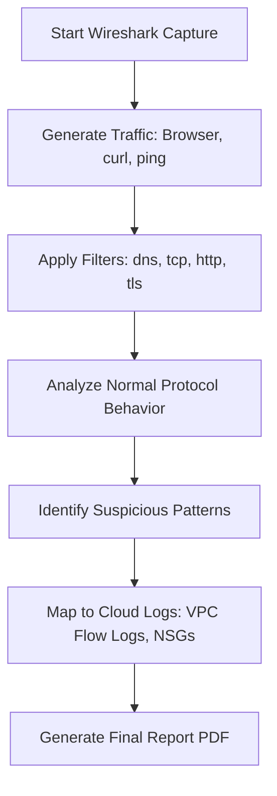
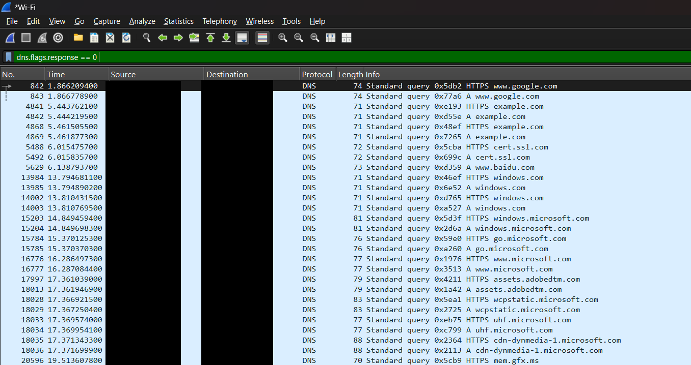
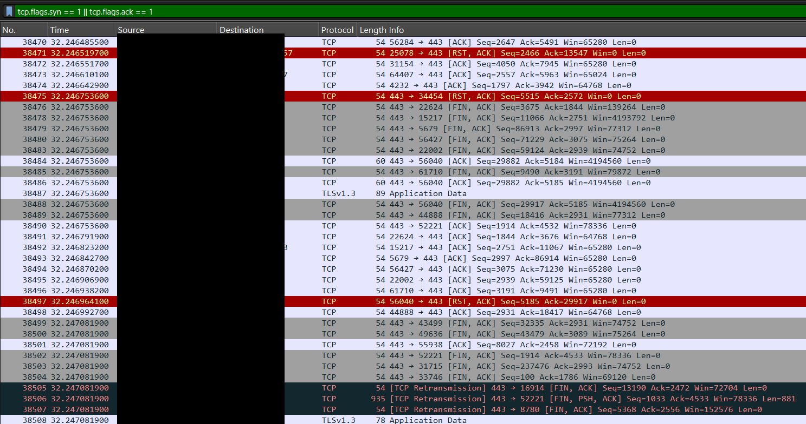

# ☁️ Cloud Network Traffic Analysis Report

Cloud visibility project analyzing DNS, TCP, HTTP, and TLS traffic and translating findings into actionable AWS & Azure security controls. This hands-on network security project demonstrates packet-level analysis using Wireshark and cloud-native monitoring concepts.
The findings are translated into cloud-native security controls like **AWS VPC Flow Logs**, **Security Groups**, and **Azure NSGs**.

---
## 📚 Table of Contents

- [Key Objectives](#-key-objectives)
- [Tools & Technologies](#-tools--technologies)
- [Methodology Summary](#-methodology-summary)
- [Deliverables](#-deliverables)
- [Project Value](#-project-value-for-interviews--resume)
- [License](#-license)

## 🎯 Key Objectives

- 🧲 Capture live network traffic using Wireshark (DNS, TCP, HTTP/HTTPS)
- 🧪 Analyze protocol behavior and conceptually suspicious patterns
- ☁️ Map findings to cloud infrastructure: VPC Logs, SGs, NSGs
- 📑 Generate a detailed security report for cloud monitoring use cases
- 🧠 Build strong cloud security thinking through packet visibility

---

## 🛠️ Tools & Technologies

- **Wireshark** – Protocol analysis
- **Ubuntu 22.04 / Windows 10** – OS testing environments
- **Browsers / curl / ping** – Traffic generation
- **AWS** – VPC Flow Logs, Security Groups
- **Azure** – NSG Flow Logs, Sentinel
- **Google Docs / Word** – Report writing & screenshots

---

## 🔬 Methodology Summary

## 📦 Deliverables

| File/Folder | Description |
|-------------|-------------|
| `docs/Cloud Network Traffic Analysis Report.pdf` | 📄 Full technical report |
| `captures/ubuntu-baseline.pcap` | 🐧 Linux network capture | 
| `captures/windows-baseline.pcap` | 🪟 Windows network capture | 
| `screenshots/` | PNGs showing key protocol observations (e.g., DNS, TCP handshake) |
| `filters/wireshark-filters.md` | 🔍 Wireshark display filters used |

---

## 🖼️ Preview

  
  

## 💡 Project Value (For Interviews & Resume)

> “I analyzed live network traffic across Linux and Windows using Wireshark, identified protocol behaviors and suspicious patterns, and mapped them to cloud security controls such as AWS VPC Flow Logs and Azure NSG rules. This project demonstrates my ability to turn low-level traffic visibility into cloud-native security decisions.”

---

## 📝 License

This project is licensed under the [MIT License](LICENSE).

---

## 👥 Authors

- **🎓 Project Lead:** [Swasthi Kunder](https://github.com/swasthikunder)  
- **🔧 Contributor:** [Sakshat S](https://github.com/Sakshats993)

For collaboration or questions, feel free to reach out via GitHub.

